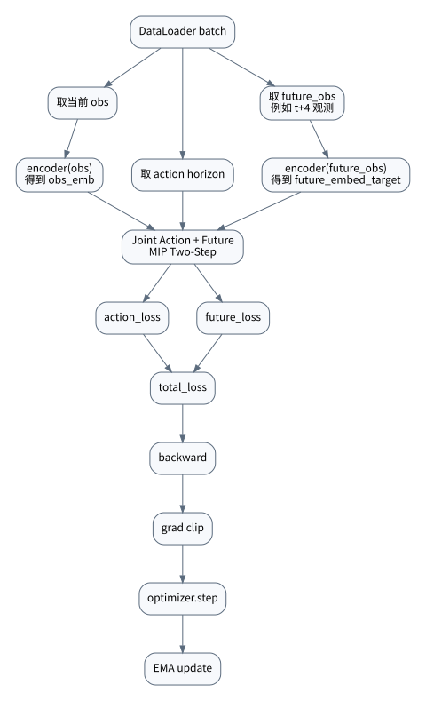
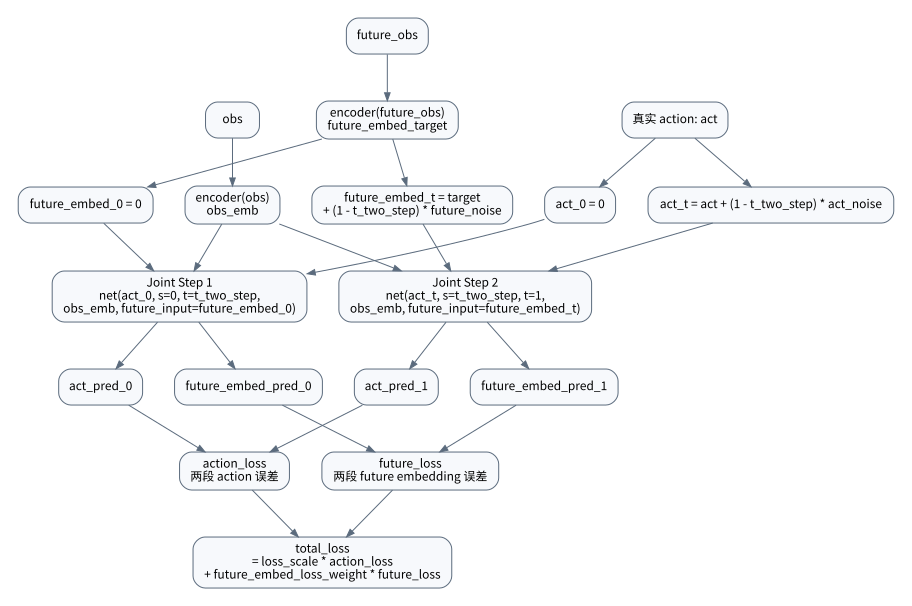
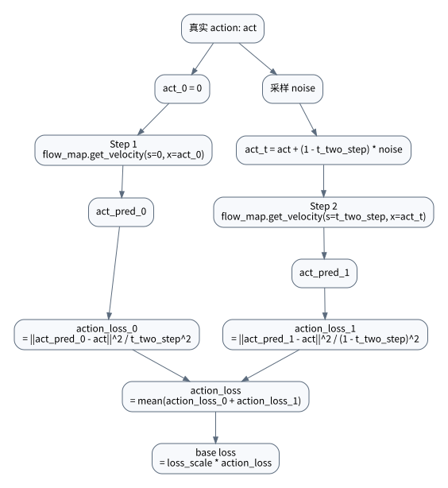
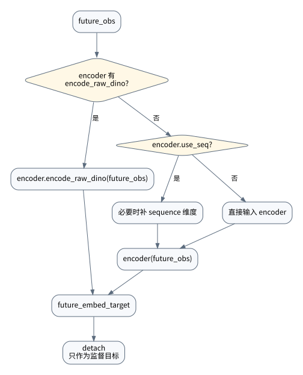
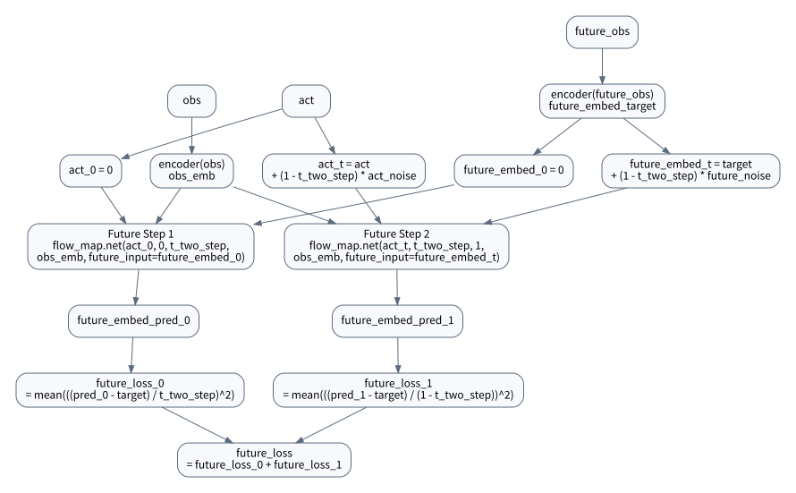
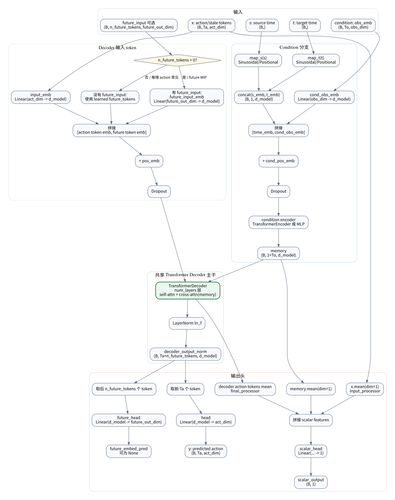
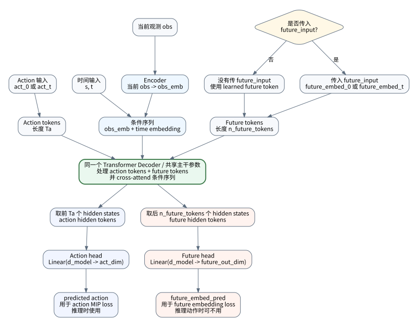
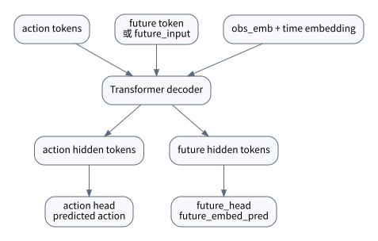

# Future MIP Two-Step Flow

本文梳理预测未来版本的训练流程，对应配置：

```yaml
optimization:
  loss_type: "mip"
  use_future_embed_loss: true
  future_embed_loss_mode: "mip_two_step"
  future_embed_loss_weight: 0.1

network:
  n_future_tokens: 1

task:
  future_state_enabled: true
  future_state_steps: 4
  future_target_type: "embedding"
```

核心目标是：让 action 和 future embedding 在同一次 two-step MIP 里一起计算。每一段 forward 同时输出 `act_pred` 和 `future_embed_pred`，再把 action loss 与 future loss 加权求和。

## 总体流程



当前 joint 版本的关键路径如下：



训练入口在 `examples/train_robomimic.py`。每个 batch 会取：

- `obs`: 当前观测窗口
- `act`: 动作 horizon
- `future_obs`: 数据集预先取出的未来观测
- `delta_t`: warmup scheduler 给出的时间步差

然后调用：

```python
info = agent.update(act, obs, delta_t, future_obs=future_obs)
```

## Action MIP 两段

joint 版本中，action loss 不再单独调用 `mip/losses.py::mip_loss`，而是在 `TrainingAgent._compute_joint_mip_two_step_loss` 里和 future loss 共用同两次 `flow_map.net(...)` forward。



代码公式实际是：

```python
loss0 = (get_norm(act_pred_0 - act, norm_type) / t_two_step) ** 2
loss1 = (get_norm(act_pred_1 - act, norm_type) / (1 - t_two_step)) ** 2
action_loss = torch.mean(loss0 + loss1)
loss = loss_scale * action_loss
```

注意：这里不是 `total_loss = action_loss`，而是先乘 `loss_scale`。

## Future Target 构造

future 分支先把未来观测编码成目标 embedding。



对应逻辑在 `TrainingAgent._encode_future_target`。

## Future Embedding MIP 两段

当 `future_embed_loss_mode == "mip_two_step"` 时，走 `TrainingAgent._compute_joint_mip_two_step_loss`。这时 action 和 future embedding 是一起算的，不是两套 forward 分开算。



代码公式：

```python
future_embed_target = encode_future_target(future_obs).detach()

future_embed_0 = torch.zeros_like(future_embed_target)
future_embed_t = future_embed_target + (1 - t_two_step) * future_noise

act_0 = torch.zeros_like(act)
act_t = act + (1 - t_two_step) * act_noise

act_pred_0, _, future_embed_pred_0 = flow_map.net(
    act_0,
    s,
    t,
    obs_emb,
    future_input=future_embed_0,
)[2]

act_pred_1, _, future_embed_pred_1 = flow_map.net(
    act_t,
    t,
    torch.ones_like(t),
    obs_emb,
    future_input=future_embed_t,
)[2]

future_loss_0 = torch.mean(
    ((future_embed_pred_0 - future_embed_target) / t_two_step) ** 2
)
future_loss_1 = torch.mean(
    ((future_embed_pred_1 - future_embed_target) / (1 - t_two_step)) ** 2
)
future_loss = future_loss_0 + future_loss_1
```

## Loss 组合

预测未来版本的总 loss 是：

```text
total_loss =
    loss_scale * action_loss
    + future_embed_loss_weight * future_loss
```

展开后是：

```text
total_loss =
    loss_scale * mean(action_loss_0 + action_loss_1)
    + future_embed_loss_weight * (future_loss_0 + future_loss_1)
```

如果使用默认值：

```yaml
t_two_step: 0.9
future_embed_loss_weight: 0.1
```

那么 future 两段内部的误差缩放为：

```text
future_loss_0 系数 = 1 / 0.9^2  ~= 1.23
future_loss_1 系数 = 1 / 0.1^2  = 100
```

因此在 raw error 相同的情况下：

```text
future_loss_1 / future_loss_0 ~= 81
```

这不是额外配置出来的比例，而是由 `t_two_step` 决定的。`t_two_step` 越接近 1，第二段 `t_two_step -> 1` 的区间越短，`future_loss_1` 被放大的程度越高。

## 网络输出

`ChiTransformer` 在 `n_future_tokens > 0` 时会额外启用 future token 和 `future_head`。

项目中的完整结构大致如下：



更直观地看，它是同一个 Transformer 主干，最后从不同 token 位置读出不同任务的输出：





所以同一个 `flow_map.net(...)` 调用会返回三项：

```python
predicted_action, scalar_output, future_embed_pred
```

future MIP 分支只使用第三项 `future_embed_pred` 来和 `future_embed_target` 对齐。

对应到代码，`decoder_output` 会被切成两部分：

```python
action_tokens = decoder_output_norm[:, : self.Ta, :]
future_tokens = decoder_output_norm[:, self.Ta :, :]
```

然后分别接两个 head：

```python
y = self.head(action_tokens)
future_embed_pred = self.future_head(future_tokens)
```

因此 action 和 future embedding 共用 `input_emb`、条件编码、Transformer decoder、LayerNorm 等主干参数；但监督目标不同，最终输出头也不同。

当前默认配置里 decoder self-attention 不使用 causal mask，cross-attention 也不使用 memory mask：

```python
decoder_output = self.decoder(
    tgt=decoder_input,
    memory=memory,
    tgt_mask=self.mask if self.use_causal_mask else None,
    memory_mask=self.memory_mask if self.use_memory_mask else None,
)
```

默认配置：

```yaml
network:
  use_causal_mask: false
  use_memory_mask: false
```

因此 action tokens 和 future tokens 可以在同一次 decoder forward 中互相 attend，并且所有 decoder token 都能看完整 `time + obs` condition。如需恢复旧行为，可以把对应配置设为 `true`。

## 当前实现中的两个 future 路径

代码里存在两个 future loss 路径：

1. 旧路径：`mip_loss(..., future_obs=future_obs)`
   - 在 `mip/losses.py` 内部直接计算 future loss
   - 权重是 `future_state_loss_weight`

2. 新路径：`use_future_embed_loss: true`
   - `future_embed_loss_mode: "direct"` 时，在 `TrainingAgent.update` 中额外调用 direct future embedding loss
   - `future_embed_loss_mode: "mip_two_step"` 时，使用 joint action + future two-step loss
   - `future_embed_loss_mode` 可选 `direct` 或 `mip_two_step`
   - 权重是 `future_embed_loss_weight`

当前预测未来 two-step 配置走的是第二条路径：

```yaml
use_future_embed_loss: true
future_embed_loss_mode: "mip_two_step"
```

因此最终采用：

```text
loss_scale * action_loss + future_embed_loss_weight * future_loss
```

而不是：

```text
loss_scale * action_loss + future_state_loss_weight * future_loss
```
