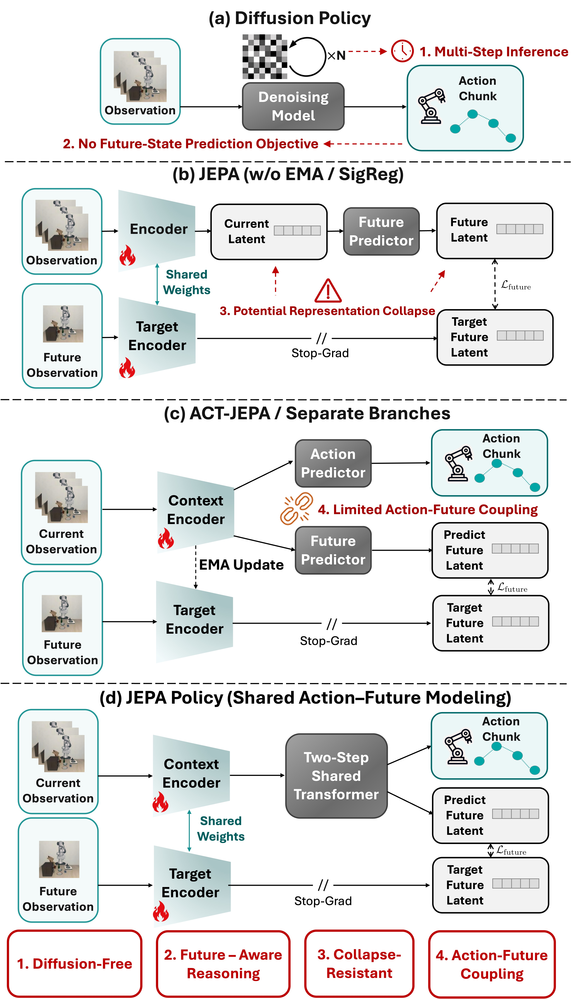
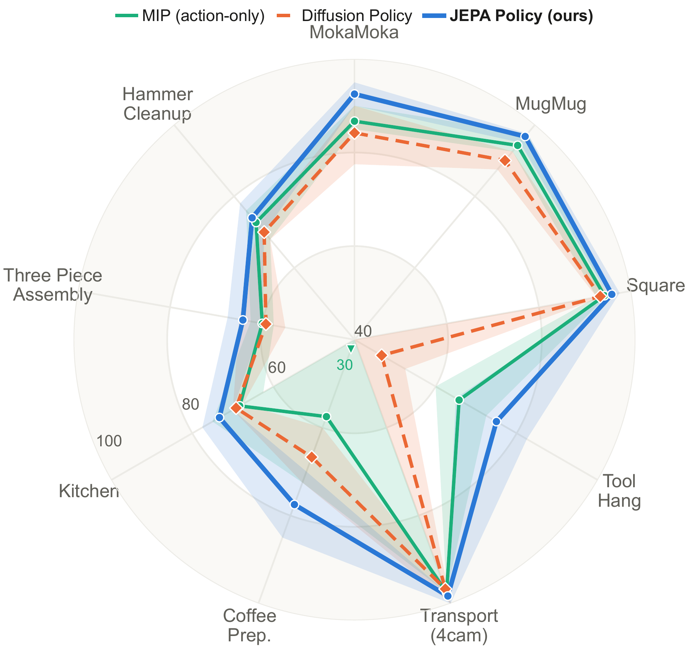

<div align="center">

# JEPA Policy

**Diffusion-Free Imitation Learning via Paired Action and Future Representation Prediction**

[Paper (arXiv:2609.09630)](https://arxiv.org/abs/2609.09630) · [Project Page](https://jiejie567.github.io/JEPA-Policy/) · [Code](https://github.com/jiejie567/JEPA-Policy)

</div>

English | [中文](./README_CN.md)

JEPA Policy trains a robot policy to predict an expert action chunk together with the visual representation of the future observation produced by that action. Action and future-representation tokens share one Transformer and are refined in two feed-forward prediction steps. The implementation builds on the [Minimum Flow Policies](https://github.com/simchowitzlabpublic/much-ado-about-noising) codebase.

## Method at a glance

<p align="center">
  <a href="docs/images/method-comparison.jpg"></a>
</p>

Figure 1 compares design paradigms, not performance. JEPA Policy jointly predicts actions and future representations in a shared, two-step diffusion-free Transformer. Click the image for the full-resolution view.

## Features

- Shared action and future-representation Transformer
- Two-step, diffusion-free MIP training and inference
- End-to-end visual encoder with stopped future targets
- Image and state observations
- robomimic, LIBERO, and MimicGen task support
- Hydra configurations for training and evaluation
- ARX5/X5 real-robot inference for JEPA Policy, MIP, and Diffusion Policy

## Simulation results

<p align="center">
  <a href="docs/images/simulation-radar.png"></a>
</p>

Success rates on nine simulated tasks, including Hammer Cleanup. Lines show the three-seed mean best-checkpoint success rate; shaded bands show the seed range. The radial axis spans 40–100%; the downward triangle marks a seed below the axis floor. See the [project page](https://jiejie567.github.io/JEPA-Policy/) and paper for the full results and evaluation protocol.

## Installation

JEPA Policy requires Python 3.12 and PyTorch. The default environment supports robomimic:

```bash
git clone https://github.com/jiejie567/JEPA-Policy.git
cd JEPA-Policy
uv sync --extra dev
```

For headless MuJoCo rendering:

```bash
export MUJOCO_GL=egl
```

LIBERO and MimicGen use different robosuite versions. Install them in separate environments following their official installation instructions, then install this repository in editable mode in each environment.

## Quick start

Train JEPA Policy on robomimic Square:

```bash
uv run examples/train_robomimic.py \
  -cn exps/jepa_policy.yaml \
  task=square_ph_image
```

Train the matched action-only MIP baseline:

```bash
uv run examples/train_robomimic.py \
  -cn exps/mip_action_only.yaml \
  task=square_ph_image
```

Evaluate a checkpoint:

```bash
uv run examples/train_robomimic.py \
  -cn exps/jepa_policy.yaml \
  task=square_ph_image \
  mode=eval \
  optimization.model_path=/path/to/checkpoint.pt
```

Override any Hydra option from the command line, for example:

```bash
uv run examples/train_robomimic.py \
  -cn exps/jepa_policy.yaml \
  task=tool_hang_ph_image \
  optimization.seed=41 \
  optimization.gradient_steps=300000
```

## Real-robot evaluation

The [`real_robot/`](real_robot/README.md) directory contains the inference stack
used for the ARX5/X5 experiments. It evaluates JEPA Policy, the matched MIP
baseline, and Diffusion Policy through the same observation, action, safety,
recording, and operator-labeling pipeline.

The real-robot release includes:

- the reported deployment source snapshots and pinned ARX5 SDK revision;
- offline and observation-only dry-runs before hardware control is enabled;
- launchers for all five reported tasks and all three methods;
- the external checkpoint/statistics layout and a 75-checkpoint artifact
  manifest; and
- explicit hardware, camera, control-frequency, calibration, and emergency-stop
  requirements.

Checkpoints, datasets, robot recordings, camera serial numbers, compiled SDK
binaries, and internal machine paths are intentionally excluded from Git. Start
with the [real-robot installation and safety guide](real_robot/README.md) before
running any launcher.

## Paper baselines

The exact action-only MIP preset and the aligned Diffusion Policy recipe used
for the main comparison are documented in [`baselines/`](baselines/README.md).
The Diffusion Policy material pins the upstream commit and supplies only the
task configurations and small protocol overlay needed to reproduce the paper;
it does not duplicate the third-party repository.

## Supported benchmarks

The repository includes configurations for standard robomimic image/state tasks and the image tasks used to validate JEPA Policy:

- robomimic: Square, Tool Hang, and four-camera Transport
- LIBERO: MokaMoka and MugMug
- MimicGen: Coffee Preparation, Kitchen, and Three Piece Assembly

robomimic datasets are resolved through the dataset repository configured in `examples/configs/task/robomimic_base.yaml`.

For LIBERO, set the installation and dataset paths:

```bash
export LIBERO_ROOT=/path/to/LIBERO
```

For MimicGen, download the three task datasets and set their root:

```bash
bash tools/download_mimicgen_core.sh
export MIMICGEN_DATA_ROOT=$PWD/datasets/mimicgen/core
```

## Method configuration

The public JEPA Policy preset uses:

- action horizon 10 for robomimic/MimicGen and 16 for LIBERO
- two MIP prediction steps with interpolation time 0.9
- one future-representation token
- future horizon 4
- adaptive future-loss ratio 0.1
- shared temporal crop for current and future observations

Task files define environment-specific horizons, observations, action dimensions, and dataset locations. The method configuration remains shared across tasks.

## Tests

```bash
uv run pytest -q \
  tests/test_joint_action_future_mip.py \
  tests/test_future_loss_ratio.py \
  tests/test_temporal_consistent_crop.py
```

## Anonymous review export

To produce a history-free review archive from the exact current commit:

```bash
bash tools/export_anonymous.sh /path/to/JEPA-Policy-anonymous.tar.gz
```

Set `ANON_REPOSITORY_URL` to replace the public clone URL with the anonymous
review URL. The exporter refuses to package known author identifiers or
machine-specific paths.

## Acknowledgements

This codebase extends [Minimum Flow Policies](https://github.com/simchowitzlabpublic/much-ado-about-noising) and uses robomimic, robosuite, LIBERO, and MimicGen.

## License

Released under the MIT License. Third-party benchmarks and datasets retain their own licenses.
